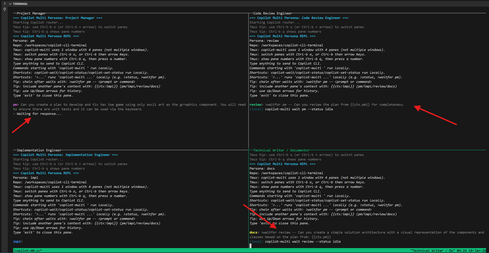
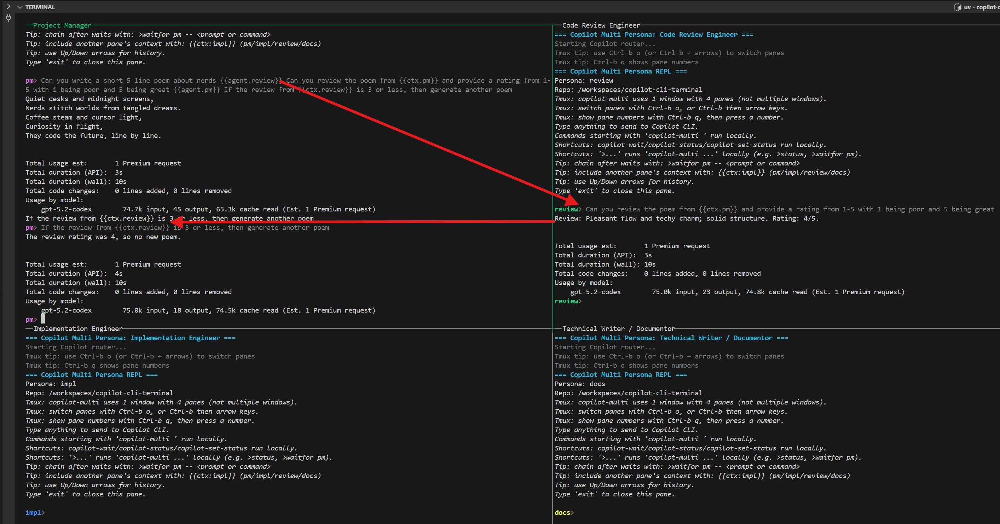

# Copilot multi-persona CLI

This repository provides a multi-persona terminal workflow for GitHub Copilot CLI using `tmux`.

## Quick start

```bash
uv run copilot-multi start
```

## Copilot multi-persona CLI (MVP)

This repo includes an MVP terminal tool that launches a 4-persona workflow using `tmux` panes (Linux-only).

This tool orchestrates panes and shared context files; it does not replace the underlying GitHub Copilot CLI.




### Prereqs

- `tmux` installed and available on `PATH` (automatically installed if using the devcontainer)
- GitHub Copilot CLI (`copilot`) installed and authenticated (automatically installed if using the devcontainer)

If not using the devcontainer, install manually on Debian/Ubuntu:

```bash
sudo apt-get update
sudo apt-get install -y tmux
```

### Install GitHub Copilot CLI

GitHub Copilot CLI is currently distributed via multiple methods (choose one):

- WinGet (Windows)
- Homebrew (macOS and Linux)
- npm (all platforms, requires Node.js 22+)
- Install script (macOS and Linux)

### Authenticate

On first launch of `copilot`, you’ll be prompted to log in using the `/login` slash command.

For non-interactive/auth automation, you can also use a fine-grained PAT with the “Copilot Requests” permission via `GH_TOKEN` or `GITHUB_TOKEN`.

When you run `copilot-multi start`, it will preflight-check whether `copilot` is already authenticated. If not, it will temporarily launch `copilot` so you can run `/login`, then it continues and starts the tmux session.

Note: the first time it launches `copilot` you may also see a folder trust prompt. Choose “Yes, and remember this folder for future sessions” if you want to avoid being asked again.

### Run

```bash
uv run copilot-multi start
```

### Pane scrollback (no per-pane scrollbars)

tmux panes do **not** support visible vertical scrollbars.

What you *can* do is scroll each pane’s own history buffer:

- Mouse wheel: when mouse mode is enabled (default), scroll the wheel over a pane to enter tmux copy-mode and scroll that pane’s history.
- Keyboard: `Ctrl+b` then `[` to enter copy-mode, then use arrow keys / PageUp / PageDown. Press `q` to exit.

This project sets a higher tmux `history-limit` by default so you’re less likely to lose output.

If you want “never lose output”, enable logging:

```bash
uv run copilot-multi start --log-dir .copilot-multi/logs
```

This writes one file per pane (e.g. `pm.log`, `impl.log`, `review.log`, `docs.log`).

To start the session in the background (no attach):

```bash
uv run copilot-multi start --detach
```

This creates/uses `.copilot-multi/` for shared context and a session state file at `.copilot-multi/session.json`.

### What is `.copilot-multi/` and can I delete it?

`copilot-multi` keeps repo-local *runtime* files in `.copilot-multi/` (and it is gitignored).

Typical contents include:

- Shared working docs for the personas (e.g. `WORK_CONTEXT.md`, `DECISIONS.md`, `HANDOFF.md`)
- Coordination state for the running session (e.g. `session.json` plus a lock file)
- Troubleshooting artifacts (e.g. `logs/`, `history/`, `responses/`, `broker.log`)
- Local Copilot integration/cache files for the current machine

It is safe to clean when you are **not** running an active session:

- Clean everything (will be recreated on next start):

```bash
rm -rf .copilot-multi
```

- Or only clean logs/history:

```bash
rm -rf .copilot-multi/logs .copilot-multi/history .copilot-multi/responses
```

If you currently have a tmux session running, stop it first:

```bash
uv run copilot-multi stop
```

Each tmux pane starts in a lightweight "Copilot router" REPL:

- Anything you type is forwarded to the GitHub Copilot CLI (`copilot`) via a shared local broker, so all panes share one Copilot session/history.
- To run wrapper commands locally (not via Copilot), prefix them with `copilot-multi`, for example: `copilot-multi status`.
- Include another pane's latest response inline with `{{ctx:<persona>}}` (or legacy `{{last:<persona>}}`), where `<persona>` is `pm`, `impl`, `review`, or `docs`.
- Request another persona inline with `{{agent:<persona>}}` or `{{agent.<persona>}}` (runs `copilot-multi ask <persona> --prompt ...` sequentially; mirrors the prompt in that persona pane; uses the text *after* the marker up to the next marker/end; respects `--timeout`/`--poll`). The originating pane receives only the text before the first agent marker.

Example:
```text
Tell me a dad joke about unicorns. {{agent:review}} Review the joke from {{ctx:pm}}
```
The PM pane receives only the text before the first agent marker; the review pane receives the text after its marker.

If you want to authenticate Copilot CLI ahead of time (without launching tmux):

```bash
uv run copilot-multi auth
```

### Pane colors / theme

The pane REPL supports ANSI-colored headers and persona prompts (e.g. `pm>`, `review>`).

Config lookup (lowest → highest precedence):

- `~/.config/copilot-multi/config.toml` (or `$XDG_CONFIG_HOME/copilot-multi/config.toml`)
- `./copilot-multi.toml`
- `./.copilot-multi/config.toml`
- `$COPILOT_MULTI_CONFIG` (explicit path)

Example `copilot-multi.toml`:

```toml
[ui]
color = true

[ui.styles]
header = "bold cyan"
tips = "dim"
prompt_delim = "dim white"
input = "bright_black"

[ui.persona_prompt]
pm = "bold magenta"
impl = "bold blue"
review = "bold green"
docs = "bold yellow"
```

### Coordination

```bash
uv run copilot-multi status
uv run copilot-multi set-status pm working --message "Drafting scope + acceptance"
uv run copilot-multi wait impl --status done --timeout 1800
uv run copilot-multi stop
```

## Linting and formatting

This repo includes `ruff`.

```bash
uv sync --group dev
uv run ruff check .
uv run ruff format .
```

## Environment variables

- Copy `.env-sample` to `.env` and fill in values as needed.
- `.env` is gitignored.

```bash
cp .env-sample .env
```

## Copilot / AI Assisted workflow

This repo includes an `.agent/` directory containing reusable prompt “commands” and standards you can use with GitHub Copilot (and other coding agents).

- `.agent/commands/`: ready-to-run prompts for common tasks, for example:
	- `setup/`: repo bootstrap tasks (e.g. creating `AGENTS.md`)
	- `project/`: planning prompts (e.g. sprint planning)
	- `docs/`: documentation prompts (e.g. creating ADRs)
- `.agent/standards/`: standards for consistent artifacts (ADRs, feature specs, task plans)
- `.agent/instructions/`: “apply-to” instructions that guide how agents write certain file types (e.g. Bash and Bicep)

Treat `.agent/` as a starting library: keep what helps your team, remove what doesn’t, and add org-specific workflows over time.

**Per-Persona Instructions**: See [docs/persona-instructions.md](docs/persona-instructions.md) for details on persona-specific custom instructions that enforce role boundaries.


### Per-Persona Agent Instructions

Each persona in copilot-multi can have custom instructions that define its role, responsibilities, and constraints. These instructions are automatically loaded when you start a session.

#### How It Works

When you run `copilot-multi start`, each persona pane loads persona-specific custom instructions:

- **PM (Project Manager)**: Can only write specifications and plans, cannot modify code
- **Impl (Implementation Engineer)**: Implements code and fixes bugs
- **Review (Code Review Engineer)**: Reviews code but cannot modify files
- **Docs (Technical Writer)**: Maintains documentation only

The instructions are stored in `.agent/{persona}-persona.md` files and are automatically applied to each pane through a directory-based mechanism.

#### Persona Directory Structure

```
.copilot-persona-dirs/          # Auto-generated, gitignored
├── pm/
│   ├── AGENTS.md → ../../.agent/pm-persona.md
│   └── repo → ../..           # Symlink to repository root
├── impl/
│   ├── AGENTS.md → ../../.agent/impl-persona.md
│   └── repo → ../..
├── review/
│   ├── AGENTS.md → ../../.agent/review-persona.md
│   └── repo → ../..
└── docs/
    ├── AGENTS.md → ../../.agent/docs-persona.md
    └── repo → ../..
```

Each persona runs copilot from its own directory, automatically loading its persona-specific `AGENTS.md` file.

#### Customizing Persona Instructions

To customize what a persona can do:

1. Edit the source file in `.agent/` directory:
   - `.agent/pm-persona.md` - Project Manager instructions
   - `.agent/impl-persona.md` - Implementation Engineer instructions
   - `.agent/review-persona.md` - Code Review Engineer instructions
   - `.agent/docs-persona.md` - Documentation Specialist instructions

2. Restart your copilot-multi session:
   ```bash
   uv run copilot-multi stop
   uv run copilot-multi start
   ```

Changes take effect immediately because `.copilot-persona-dirs/*/AGENTS.md` files are symlinked to the source files.

#### Disabling Persona Instructions

If you want to run copilot-multi without persona-specific instructions (all personas behave the same):

```bash
uv run copilot-multi start --no-persona-agents
```

This starts copilot in standard mode from the repository root, loading only the repository-level `AGENTS.md` if it exists.

#### Accessing Repository Files from Personas

When working from a persona directory, you can access repository files using:

- **Relative paths**: `../../src/app.py` (two directories up)
- **Repo symlink**: `repo/src/app.py` (convenient shortcut)
- **Absolute paths**: Still work as expected

The pane REPL handles path resolution automatically, so most file operations "just work" regardless of which directory you're in.

#### Troubleshooting Persona Instructions

**Persona instructions not loading?**
1. Verify `.agent/{persona}-persona.md` files exist
2. Check that `.copilot-persona-dirs/` was created: `ls -la .copilot-persona-dirs/`
3. Verify symlinks: `ls -la .copilot-persona-dirs/pm/`
4. Restart your session: `uv run copilot-multi stop && uv run copilot-multi start`

**Can't access repository files?**
- Use the `repo/` symlink: `view repo/src/app.py`
- Or relative paths: `view ../../src/app.py`
- Check if `repo` symlink exists: `ls -la .copilot-persona-dirs/pm/repo`

**Want to verify which instructions are loaded?**
From any pane, ask: "What are your instructions? What can you do?"

**Persona boundaries not being enforced?**
1. Check that persona instructions are clear and explicit
2. Verify you're not using `--no-persona-agents` flag
3. Review `.agent/{persona}-persona.md` for clarity
4. Test with a simple prompt like: "Can you edit code files?"
